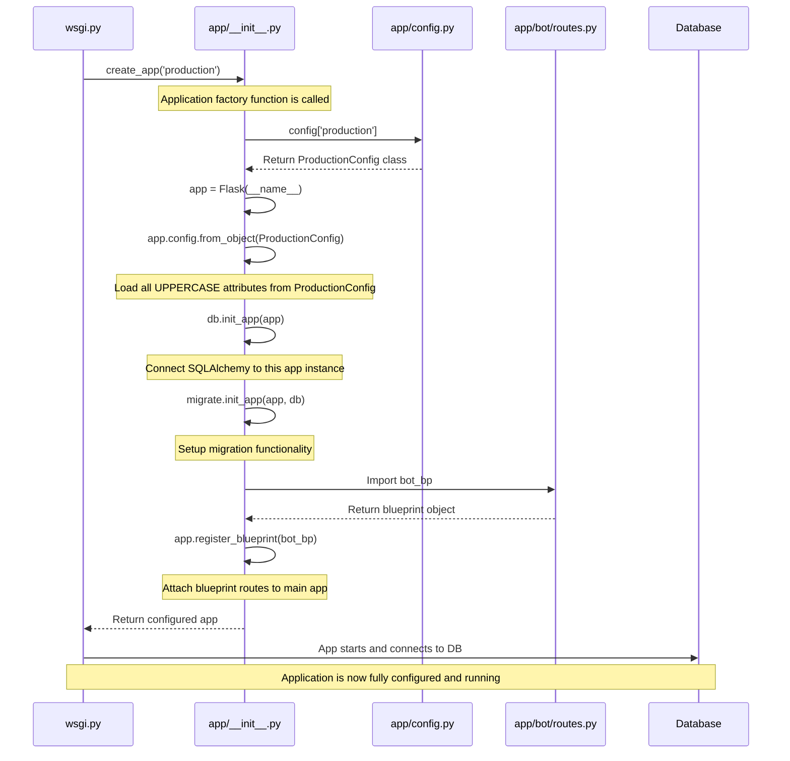

This diagram visualizes the Flask application factory pattern. 

1. **Initialization Flow:**
     - The process starts in `wsgi.py` when it calls `create_app('production')`
     - This triggers the application factory function in `app/__init__.py`
2. **Configuration Loading:**
     - The factory gets the appropriate config class from our config dictionary
     - It applies all configuration settings to the app using `from_object()`
     - All uppercase attributes (like `SECRET_KEY`, `DEBUG`, etc.) are loaded
3. **Extension Connection:**
     - Database connections and other extensions are initialized
     - The previously created extension objects get connected to this specific app instance
4. **Blueprint Registration:**
     - Routes and functionality from separate modules (blueprints) are imported
     - These blueprints are registered with the main app
5. **Application Return:**
     - The fully configured app is returned to `wsgi.py`
     - The app connects to the database when it starts running

This pattern gives flexibility to create different app instances with different configurations while keeping the code organized and avoiding circular imports.

The key benefit is that the app isn't created until `create_app()` is called, and it can be created with different settings based on different needs.